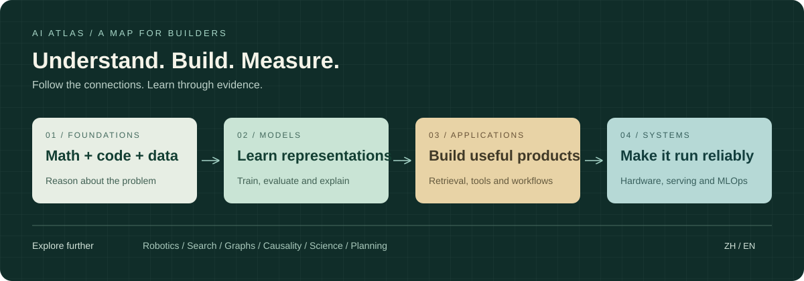

---
hide:
  - toc
---

# AI Atlas

从第一行代码，到理解整个 AI 系统

## 把 AI 的知识，连成你走得通的路。

数学与算法让你理解模型，应用开发让你交付产品，系统与硬件让它可靠运行。选一个起点，沿着先修关系学习，用项目检验理解。

[开始学习](start.md){ .md-button .md-button--primary }
[浏览知识地图](map.md){ .md-button }

- **01 / 打牢基础**

    从数学、Python、数据，到机器学习和深度学习。每一阶段都有能完成的小实验。

    [零基础路线 →](roadmaps/beginner.md)

- **02 / 做出应用**

    从检索与模型调用，到 RAG、Agent、评估与产品交付。先把结果的质量测出来。

    [应用开发路线 →](roadmaps/application.md)

- **03 / 理解系统**

    从显存与性能预算，到 GPU 算子、分布式训练、推理服务和生产运维。

    [AI Infra 路线 →](roadmaps/infra.md)

## 从这里找到下一步

| 想做的事 | 入口 |
|---|---|
| 看完整知识版图和先修关系 | [27 个专题](map.md) |
| 根据基础、目标与每周时间做选择 | [6 条学习路线](roadmaps/README.md) |
| 找中文、免费或无需 GPU 的资料 | [精选资源目录](resources.md) |
| 先在自己的电脑上跑起来 | [本地实验与项目任务](projects/README.md) |
| 读论文、安排学习或解决环境问题 | [学习方法](guides/study-method.md) · [环境与算力](guides/environment.md) |
| 看我们参考了什么、如何核实 | [调研记录](research/README.md) |

## 每个专题，回答五件事

**需要什么基础 → 有哪些资源 → 选哪条主线 → 按什么顺序读和练 → 做到什么算完成。**

你不必先读完所有基础才能尝试应用，也不必因为某个方向热门就放弃原来的专长。路线是可调整的学习建议；用阶段成果决定继续深入还是补课。

本版建立主干和交叉领域入口，不声称覆盖 AI 的全部知识。外部资料有明确来源和核实日期，仓库实验与外部课程的验证范围分开记录。完整边界见 [知识地图](map.md) 与 [质量记录](quality.md)。
